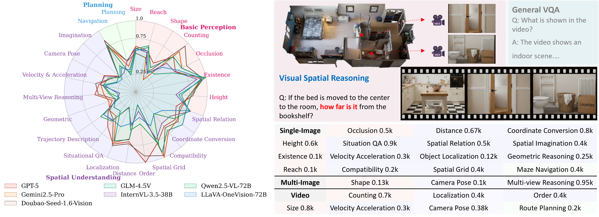

# **How Far are VLMs from True Visual Spatial Intelligence? A Benchmark-Driven Perspective**

<div align="center">
  <a href="https://song2yu.github.io/">Songsong Yu</a><sup>*1,2</sup>,
  <a href="https://github.com/Uason-Chen">Yuxin Chen</a><sup>🌟*2</sup>,
  <a href="https://haodot.github.io/">Hao Ju</a><sup>*3</sup>,
  <a href="https://github.com/JiaLianjie">Lianjie Jia</a><sup>*4</sup>,
  <a href="https://github.com/Dustzx">Fuxi Zhang</a><sup>4</sup>,
  <a href="https://spyflying.github.io/">Shaofei Huang</a><sup>3</sup>,
  <br>
  <a href="https://github.com/YuhanWu27">Yuhan Wu</a><sup>4</sup>,
  <a href="https://github.com/Cuirundi">Rundi Cui</a><sup>4</sup>,
  <a href="https://github.com/RBinghao">Binghao Ran</a><sup>4</sup>,
  <a href="https://scholar.google.com/citations?user=3SAk3GQAAAAJ&hl=en">Zhang Zaibin</a><sup>4</sup>,
  <a href="https://www.zdzheng.xyz/" target="_blank" >Zhedong Zheng</a><sup>3</sup>,
  <a href="https://zhipengzhang.cn/">Zhipeng Zhang</a><sup>1</sup>,
  <br>
  <a href="https://scholar.google.com/citations?user=j1XFhSoAAAAJ&hl=en&oi=ao" >Yifan Wang</a><sup>4</sup>,
  <a href="https://github.com/StevenGrove">Lin Song</a><sup>2</sup>,
  <a href="https://scholar.google.com/citations?hl=en&user=EfTwkXMolscC&view_op=list_works&sortby=pubdate" >Lijun Wang</a><sup>4</sup>,
  <a href="https://yanwei-li.com/">Yanwei Li</a><sup>✉️5</sup>,
  <a href="https://scholar.google.com/citations?user=4oXBp9UAAAAJ&hl=en&oi=ao" >Ying Shan</a><sup>2</sup>,
  <a href="https://scholar.google.com/citations?hl=en&user=D3nE0agAAAAJ" >Huchuan Lu</a><sup>4</sup>,
  <br><br>
  <sup>1</sup>SJTU,
  <sup>2</sup>ARC Lab, Tencent PCG,
  <sup>3</sup>UM,
  <sup>4</sup>DLUT,
  <sup>5</sup>CUHK

  \* Equal Contributions
  🌟 Project Lead
  ✉️ Corresponding Author

<p align="center">
🤗 <a href="https://huggingface.co/datasets/Two-hot/SIBench"> Dataset </a>&nbsp&nbsp | &nbsp&nbsp🌐 <a href="https://sibench.github.io/Awesome-Visual-Spatial-Reasoning/"> Leaderboard</a>&nbsp&nbsp | &nbsp&nbsp📄 <a href="https://arxiv.org/abs/2509.18905">arXiv</a>
</p>
  
</div>
<br>

## **📚 Overview**


<h6 align="center"> Evaluation of SOTA Models on 23 Visual Spatial Reasoning Tasks.</h6>


SIBench collects nearly 20 spatial reasoning datasets and categorizes them into three cognitive levels: basic perception, spatial understanding, and planning. The inputs include single images, multi-view images, and videos, while the question formats cover multiple-choice, numerical question answering, and true-or-false questions. The purpose of this benchmark is to provide a comprehensive and detailed evaluation of the spatial reasoning capabilities of existing VLMs, to serve as a convenient evaluation tool for the community, and to guide future research directions.


<h6 align="center"> Statistical data of task settings.</h6>

## **📺 Introduction**

🤗 If you find SIBench useful, **please help ⭐ this repo**, which is important to Open-Source projects. Thanks!

- `[25-09-15]` 🔥🔥🔥 **SIBench** is released now, have fun!

## **🚀 Quick Start**

**1. Clone this repo:**

```
git clone https://github.com/song2yu/SIBench-VSR.git

cd SIBench-VSR

pip install -e .

pip install transformers==4.49.0  ccelerate==0.26.0 # the specific packages that are prone to issues 
```

**2. Prepare the test data according to the following format：**

Obtain the data from the following sources:

```html
https://huggingface.co/datasets/Two-hot/SIBench
```
For convenience, we sampled the videos and retained only **30 frames** for each one. The processed data are stored in **data_sampled_video**. We recommend replacing the original videos with these and setting the total number of sampled frames to 30 frames, which is consistent with the experimental setup in our paper. If you need to change the sampling rate, you can directly use these videos.

The hierarchical structure of the data directory is:

```
SIBench_eval
└── Spatial_Intelligence_Benchmark
  └── data
      ├── 3DSRBench
      ├── BLINK
      ├── MMSI-Bench
      ├── Omni3D-Bench
      ├── OmniSpatial
      ├── SITE-Bench
      ├── SPAR-Bench
      ├── SpatialBench
      ├── SpatialEval
      ├── Spatial-MM
      ├── SpatialMQA
      ├── SPHERE-VLM
      ├── SRBench
      ├── STI-Bench
      ├── Super-CLEVR-3D
      ├── VSI-Bench
      ├── vstibench
      ├── Camera_Pose.tsv
      ├── Coordinate_Conversion.tsv
      ├── Counting.tsv
      ├── Existence.tsv
      ├── gen_tsv.py
      ├── Geometric_Reasoning.tsv
      ├── Height.tsv
      ├── Maze_Navigation.tsv
      ├── multi-view_reasoning.tsv
      ├── Object_Localization.tsv
      ├── Object_Shape.tsv
      ├── Object_Size_Estimation.tsv
      ├── Occlusion.tsv
      ├── Reach_Prediction.tsv
      ├── relative_distance.tsv
      ├── Route_Planning.tsv
      ├── Situational_QA.tsv
      ├── Spatial_Compatibility.tsv
      ├── Spatial_Grid.tsv
      ├── Spatial_Imagination.tsv
      ├── Spatial_Relation.tsv
      ├── Temporal-Appearance_Order.tsv
      ├── Trajectory_Description.tsv
      └── Velocity_Acceleration.tsv
  └── data_sampled_video
      ├──SITE-Bench
      ├──STI-Bench
      ├──VSI-Bench
      └──vstibench 
```
You can access these raw datasets:
[3DSRBench](https://huggingface.co/datasets/ccvl/3DSRBench)
[BLINK](https://huggingface.co/datasets/BLINK-Benchmark/BLINK)
[MMSI-Bench](https://huggingface.co/datasets/RunsenXu/MMSI-Bench)
[Omni3D-Bench](https://huggingface.co/datasets/dmarsili/Omni3D-Bench)
[OmniSpatial](https://github.com/qizekun/OmniSpatial)
[SITE-Bench](https://github.com/wenqi-wang20/SITE-Bench)
[SPAR-Bench](https://github.com/fudan-zvg/spar)
[SpatialBench](https://github.com/SpatialVision/Spatial-CLIP)
[SpatialEval](https://github.com/jiayuww/SpatialEval)
[Spatial-MM](https://github.com/FatemehShiri/Spatial-MM)
[SpatialMQA](https://github.com/ziyan-xiaoyu/SpatialMQA)
[SPHERE-VLM](https://github.com/zwenyu/SPHERE-VLM)
[SRBench](https://github.com/stogiannidis/srbench)
[STI-Bench](https://github.com/MINT-SJTU/STI-Bench)
[Super-CLEVR-3D](https://github.com/XingruiWang/3D-Aware-VQA)
[VSI-Bench](https://github.com/damianomarsili/VADAR)
[vstibench](https://github.com/VITA-Group/VLM-3R)


**3.  Run Examples**

To test a particular task separately, run the following code:

```
export LMUData=/your/path/to/dataset/Spatial_Intelligence_Benchmark/data

python run.py --data <setting_name> --model <model_name> --verbose

e.g.

python run.py --data relative_distance --model InternVL2_5-2B --verbose
```

**Test All Task Settings:**

modify 'LMUData=/your/path/to/dataset/Spatial_Intelligence_Benchmark/data' in test.sh and run
```
bash test.sh
```

**Supported test settings:**

```
SETTING = ['relative_distance', 'Reach_Prediction', 'Object_Shape', 'Height', 'Existence', 'Spatial_Compatibility', 'Coordinate_Conversion', 'Counting', 'Route_Planning', 'Trajectory_Description', 'Geometric_Reasoning', 'Spatial_Imagination', 'Object_Size_Estimation', 'Spatial_Grid', 'Situational_QA', 'Velocity_Acceleration', 'Maze_Navigation', 'Temporal-Appearance_Order', 'Camera_Pose', 'Occlusion', 'multi-view_reasoning', 'Object_Localization',"Spatial_Relation"]
```

## **📖 Citation**

- We launches a review [project](https://github.com/prism-visual-spatial-intelligence/Awesome-Visual-Spatial-Reasoning) on visual spatial reasoning, including 100 relevant works.

- If you find this project useful, please consider citing:

```
@article{sibench2025,
  title={How Far are VLMs from True Visual Spatial Intelligence? A Benchmark-Driven Perspective},
  author={Songsong Yu, Yuxin Chen, Hao Ju, Lianjie Jia, Fuxi Zhang, Shaofei Huang, Yuhan Wu, Rundi Cui, Binghao Ran, Zaibin Zhang, Zhedong Zheng, Zhipeng Zhang, Yifan Wang, Lin Song, Lijun Wang, Yanwei Li, Ying Shan, Huchuan Lu},
  journal={arXiv preprint arXiv:2509.18905},
  year={2025}
}
```

## **🤗 Acknowledgement**

🦄🦄🦄 This project is built upon [VLMEvalKit](https://github.com/open-compass/VLMEvalKit). We sincerely appreciate its outstanding contribution to the open-source community, and we are working on integrating SIBench into VLMEvalKit.

🤗🤗🤗 The data used in this project are derived from open-source test datasets. We have carefully selected and processed them, and we sincerely appreciate the contributions of these open-source efforts. The following lists the data sources we have cited, to which we extend our heartfelt gratitude.

```
@article{OmniSpatial,
  title={OmniSpatial: Towards Comprehensive Spatial Reasoning Benchmark for Vision Language Models},
  author={Jia, Mengdi and Qi, Zekun and Zhang, Shaochen and Zhang, Wenyao and Yu, Xinqiang and He, Jiawei and Wang, He and Yi, Li},
  journal={arXiv preprint arXiv:2506.03135},
  year={2025}
}
@article{SPHERE,
  title={Sphere: Unveiling spatial blind spots in vision-language models through hierarchical evaluation},
  author={Zhang, Wenyu and Ng, Wei En and Ma, Lixin and Wang, Yuwen and Zhao, Junqi and Koenecke, Allison and Li, Boyang and Wang, Lu},
  journal={arXiv preprint arXiv:2412.12693},
  year={2024}
}
@article{spatialeval,
  title={Is a picture worth a thousand words? delving into spatial reasoning for vision language models},
  author={Wang, Jiayu and Ming, Yifei and Shi, Zhenmei and Vineet, Vibhav and Wang, Xin and Li, Sharon and Joshi, Neel},
  journal={Advances in Neural Information Processing Systems},
  volume={37},
  pages={75392--75421},
  year={2024}
}
@article{3dsrbench,
  title={3dsrbench: A comprehensive 3d spatial reasoning benchmark},
  author={Ma, Wufei and Chen, Haoyu and Zhang, Guofeng and Chou, Yu-Cheng and de Melo, Celso M and Yuille, Alan},
  journal={arXiv preprint arXiv:2412.07825},
  year={2024}
}
@article{3dsrbench,
  title={3dsrbench: A comprehensive 3d spatial reasoning benchmark},
  author={Ma, Wufei and Chen, Haoyu and Zhang, Guofeng and Chou, Yu-Cheng and de Melo, Celso M and Yuille, Alan},
  journal={arXiv preprint arXiv:2412.07825},
  year={2024}
}
@inproceedings{Super-CLEVR-3D,
  title={Super-clevr: A virtual benchmark to diagnose domain robustness in visual reasoning},
  author={Li, Zhuowan and Wang, Xingrui and Stengel-Eskin, Elias and Kortylewski, Adam and Ma, Wufei and Van Durme, Benjamin and Yuille, Alan L},
  booktitle={Proceedings of the IEEE/CVF conference on computer vision and pattern recognition},
  pages={14963--14973},
  year={2023}
}
@article{Spatial-MM,
  title={An empirical analysis on spatial reasoning capabilities of large multimodal models},
  author={Shiri, Fatemeh and Guo, Xiao-Yu and Far, Mona Golestan and Yu, Xin and Haffari, Gholamreza and Li, Yuan-Fang},
  journal={arXiv preprint arXiv:2411.06048},
  year={2024}
}
@article{SpatialMQA,
  title={Can Multimodal Large Language Models Understand Spatial Relations?},
  author={Liu, Jingping and Liu, Ziyan and Cen, Zhedong and Zhou, Yan and Zou, Yinan and Zhang, Weiyan and Jiang, Haiyun and Ruan, Tong},
  journal={arXiv preprint arXiv:2505.19015},
  year={2025}
}
@inproceedings{Omni3D-Bench,
  title={Visual agentic ai for spatial reasoning with a dynamic api},
  author={Marsili, Damiano and Agrawal, Rohun and Yue, Yisong and Gkioxari, Georgia},
  booktitle={Proceedings of the Computer Vision and Pattern Recognition Conference},
  pages={19446--19455},
  year={2025}
}
@inproceedings{BLINK,
  title={Blink: Multimodal large language models can see but not perceive},
  author={Fu, Xingyu and Hu, Yushi and Li, Bangzheng and Feng, Yu and Wang, Haoyu and Lin, Xudong and Roth, Dan and Smith, Noah A and Ma, Wei-Chiu and Krishna, Ranjay},
  booktitle={European Conference on Computer Vision},
  pages={148--166},
  year={2024},
  organization={Springer}
}
@article{MMSI-Bench,
  title={MMSI-Bench: A Benchmark for Multi-Image Spatial Intelligence},
  author={Yang, Sihan and Xu, Runsen and Xie, Yiman and Yang, Sizhe and Li, Mo and Lin, Jingli and Zhu, Chenming and Chen, Xiaochen and Duan, Haodong and Yue, Xiangyu and others},
  journal={arXiv preprint arXiv:2505.23764},
  year={2025}
}
@article{SPAR-Bench,
  title={From flatland to space: Teaching vision-language models to perceive and reason in 3d},
  author={Zhang, Jiahui and Chen, Yurui and Zhou, Yanpeng and Xu, Yueming and Huang, Ze and Mei, Jilin and Chen, Junhui and Yuan, Yu-Jie and Cai, Xinyue and Huang, Guowei and others},
  journal={arXiv preprint arXiv:2503.22976},
  year={2025}
}
@article{STI-Bench,
  title={Sti-bench: Are mllms ready for precise spatial-temporal world understanding?},
  author={Li, Yun and Zhang, Yiming and Lin, Tao and Liu, XiangRui and Cai, Wenxiao and Liu, Zheng and Zhao, Bo},
  journal={arXiv preprint arXiv:2503.23765},
  year={2025}
}
@inproceedings{VSI-Bench,
  title={Thinking in space: How multimodal large language models see, remember, and recall spaces},
  author={Yang, Jihan and Yang, Shusheng and Gupta, Anjali W and Han, Rilyn and Fei-Fei, Li and Xie, Saining},
  booktitle={Proceedings of the Computer Vision and Pattern Recognition Conference},
  pages={10632--10643},
  year={2025}
}
@article{SITE,
  title={SITE: towards Spatial Intelligence Thorough Evaluation},
  author={Wang, Wenqi and Tan, Reuben and Zhu, Pengyue and Yang, Jianwei and Yang, Zhengyuan and Wang, Lijuan and Kolobov, Andrey and Gao, Jianfeng and Gong, Boqing},
  journal={arXiv preprint arXiv:2505.05456},
  year={2025}
}
@article{VSTiBench,
  title={VLM-3R: Vision-Language Models Augmented with Instruction-Aligned 3D Reconstruction},
  author={Fan, Zhiwen and Zhang, Jian and Li, Renjie and Zhang, Junge and Chen, Runjin and Hu, Hezhen and Wang, Kevin and Qu, Huaizhi and Wang, Dilin and Yan, Zhicheng and others},
  journal={arXiv preprint arXiv:2505.20279},
  year={2025}
}
```
